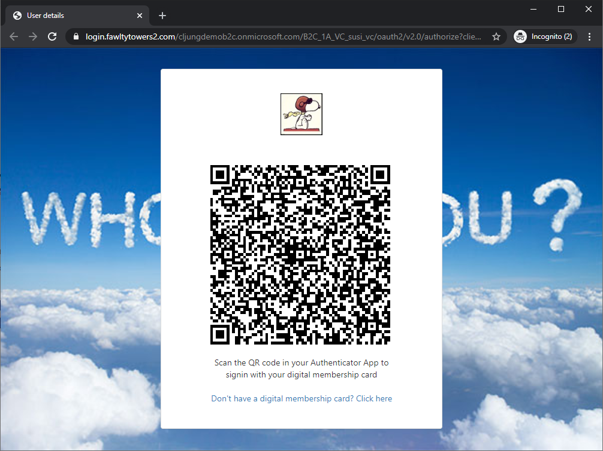

# B2C-VC-Signin
Signin to Azure AD B2C with Verifiable Credentials.

## What you will be able to do with the solution in this repository is:

- Issue Verifiable Credentials from your B2C tenant to Microsoft Authenticator on your smartphone
- Signin to B2C with your verifiable Credentials by scanning a QR code
 

## What you need to deploy and test this solution is

- An Azure AD with atleast one P1 license
- An Azure subscription
- An Azure AD B2C tenant
- Latest Microsoft Authenticator on an iOS or Android mobile device
 
## What you will deploy

- Verifiable Credentials in your Azure AD premium tenant
- An Azure Key Vault instance (or use an existing)
- An Azure Storage Account (or use an existing)
- An Azure AD B2C tenant (or use an existing)
- A public website, like Azure AppServices, for the VC issuer
- A public website, like Azure AppServices, for the VC verifier
 
For the public website, you can use [ngrok](https://ngrok.com/) during development to run the websites from your local laptop.